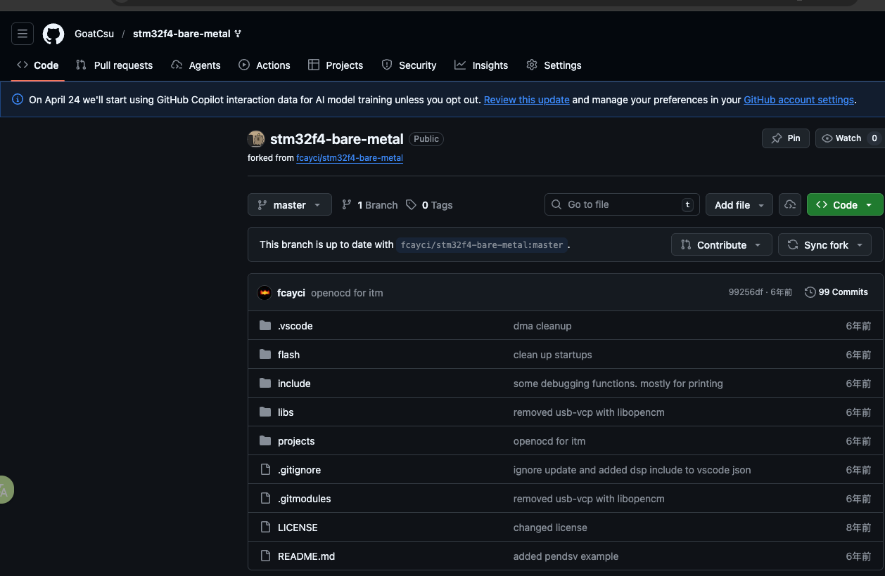
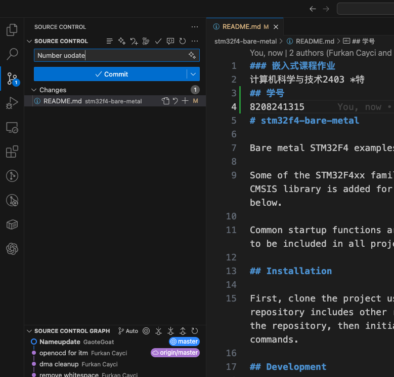
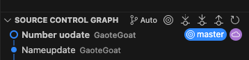
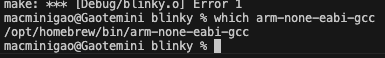
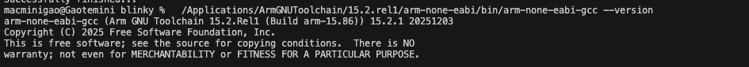
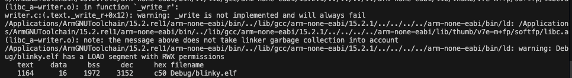
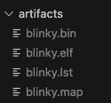

# 嵌入式课程作业报告

## 一、基本信息

- 课程名称：嵌入式课程作业
- 专业班级：计算机科学与技术 2403
- 学号：8208241315
- 项目名称：`stm32f4-bare-metal`
- 开源仓库地址：<https://github.com/GoatCsu/stm32f4-bare-metal>

## 二、实验目的

1. 学习在 GitHub 平台创建公开开源仓库，并了解开源协议的基本使用方法。
2. 掌握 Git 的基本操作流程，完成项目的版本管理与多次提交。
3. 在 macOS 环境下配置 `arm-none-eabi-gcc` 交叉编译环境。
4. 完成 STM32F4 裸机工程的编译，生成可用的固件文件。

## 三、实验环境

- 操作系统：macOS
- 交叉编译工具链：Arm GNU Toolchain 15.2.Rel1
- 编译器：`arm-none-eabi-gcc`
- 构建工具：`make`
- 版本管理工具：`git`
- 开源项目：`stm32f4-bare-metal`
- 参考源码仓库：<https://github.com/fcayci/stm32f4-bare-metal>

工具链版本信息见 [`toolchain-version.txt`](toolchain-version.txt)。

## 四、实验内容与过程

### 4.1 创建开源仓库并选择开源协议

本次作业使用 GitHub 创建公开仓库，并以 `stm32f4-bare-metal` 作为仓库名称进行管理。仓库为公开状态，可满足课程对开源仓库的要求。

本项目使用的开源协议为 MIT License。MIT 协议内容简洁，允许他人在保留版权声明的前提下自由使用、修改和分发代码，适合作为课程实验项目的开源协议。

图 1 为本次作业仓库主页截图，图中可见仓库公开状态以及根目录中的 `LICENSE` 文件。



### 4.2 Git 提交与版本管理

在仓库创建完成后，使用 Git 对项目进行版本管理，并完成了不少于两次的提交操作。第一次提交用于初始化项目内容，后续提交用于补充实验内容和作业文件。

图 2 展示了使用图形化界面进行提交操作的过程。图 3 展示了仓库的提交历史记录，可以证明本次作业完成了多次版本提交。





### 4.3 交叉编译环境配置

本次实验在 macOS 环境下完成 ARM 裸机开发工具链配置。开始阶段，终端默认命中的 `arm-none-eabi-gcc` 工具链存在 `specs` 文件缺失的问题，因此无法直接完成构建。

图 4 为早期工具链配置异常时的报错截图。通过后续排查，最终改为使用官方安装的 Arm GNU Toolchain，并将工程构建配置调整为更适合裸机环境的 `nosys.specs`。



官方工具链实际使用路径如下：

```text
/Applications/ArmGNUToolchain/15.2.rel1/arm-none-eabi/bin/arm-none-eabi-gcc
```

图 5 为最终工具链版本输出截图，可证明 `arm-none-eabi-gcc` 已在本机正确安装并可正常调用。



### 4.4 编译 STM32F4 裸机工程

本次作业选用的开源项目为 `stm32f4-bare-metal`。该项目基于 STM32F4 系列单片机，采用裸机开发方式，不依赖 HAL 库，具有较强的教学意义。

编译时进入 `projects/blinky` 目录，执行如下命令：

```bash
cd projects/blinky
make clean
make
```

在编译过程中，工程调用了 ARM 交叉编译工具链完成源文件编译、链接及二进制导出。编译成功后，终端给出构建结果：

```text
text = 1164
data = 16
bss  = 1972
dec  = 3152
hex  = c50
Successfully finished...
```

图 6 为本次工程成功编译时的终端输出截图。



完整编译日志见 [`build-log.txt`](build-log.txt)。

### 4.5 编译产物整理

为了便于作业提交，本次实验将关键编译产物统一整理到 `homework/artifacts` 目录中，主要包括：

- `blinky.elf`
- `blinky.bin`
- `blinky.map`
- `blinky.lst`

其中，`blinky.elf` 为可执行固件文件，`blinky.bin` 为二进制固件文件，`blinky.map` 为链接映射文件，`blinky.lst` 为反汇编列表文件。

图 7 为 `artifacts` 目录截图。



文件清单见 [`artifacts-list.txt`](artifacts-list.txt)，生成文件位于 [`artifacts`](artifacts/) 目录。

## 五、实验结果

本次实验成功完成了以下任务：

1. 在 GitHub 创建了公开开源仓库，并给出了仓库链接。
2. 选择了 MIT 开源协议作为项目许可证。
3. 使用 Git 完成了不少于两次的版本提交。
4. 在 macOS 环境下成功配置了 `arm-none-eabi-gcc` 交叉编译工具链。
5. 成功编译 `stm32f4-bare-metal` 项目的 `blinky` 示例工程。
6. 生成了 `.elf`、`.bin`、`.map`、`.lst` 等关键构建文件。

## 六、实验分析

通过本次实验可以看出，嵌入式项目的关键在于交叉编译环境是否配置正确。对于 STM32F4 这类 ARM Cortex-M 系列微控制器，必须使用 `arm-none-eabi-gcc` 等专用工具链，而不能直接使用系统默认的桌面编译器。

本次实验在实际操作中经历了工具链报错、编译参数调整和构建环境修正等过程，最终完成了工程编译。这说明 macOS 平台同样可以满足 ARM 裸机开发的基本需求，只要工具链版本和工程配置匹配，就能够顺利生成固件文件。

## 七、实验总结

本次嵌入式课程作业围绕“开源仓库创建”和“ARM 交叉编译环境配置”两个核心目标展开。通过本次实践，我掌握了 GitHub 开源仓库的创建方法、MIT 开源协议的基本使用方式、Git 提交流程，以及基于 `arm-none-eabi-gcc` 的 STM32F4 裸机工程编译方法。

最终，项目成功生成了可用的固件文件，验证了交叉编译环境配置的正确性，也加深了我对嵌入式开发流程和 ARM 裸机工程结构的理解。
